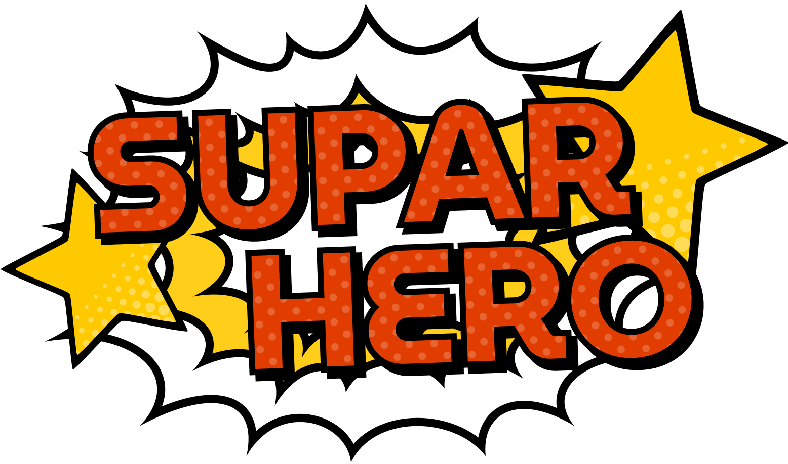
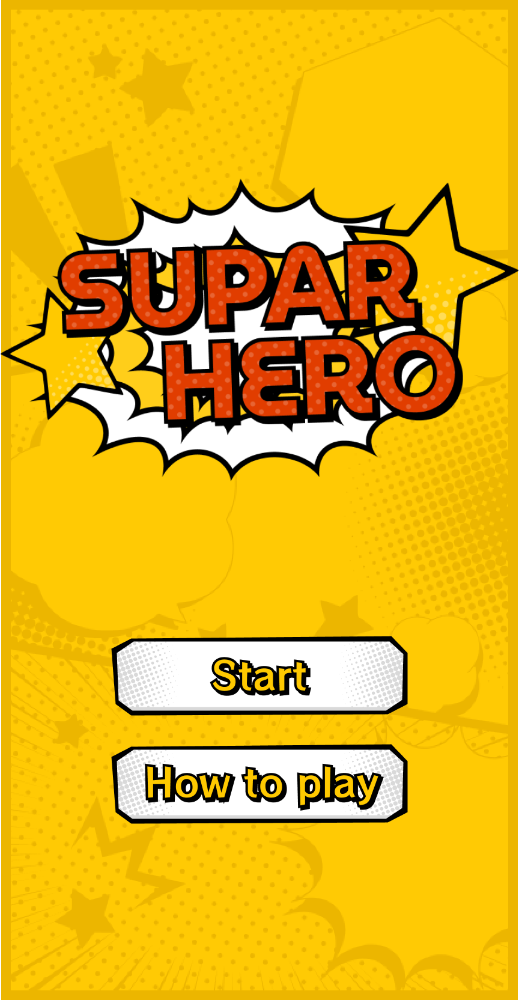
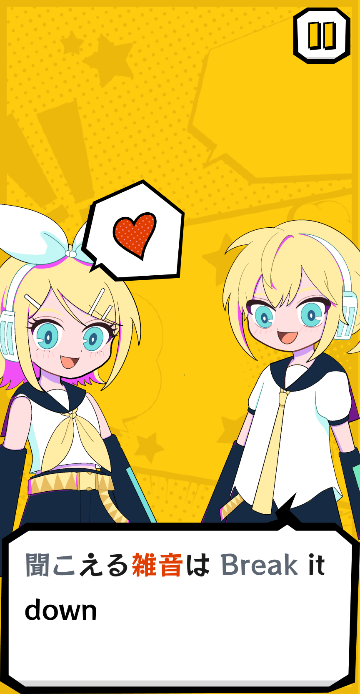
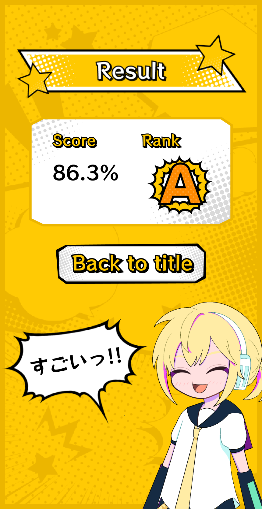
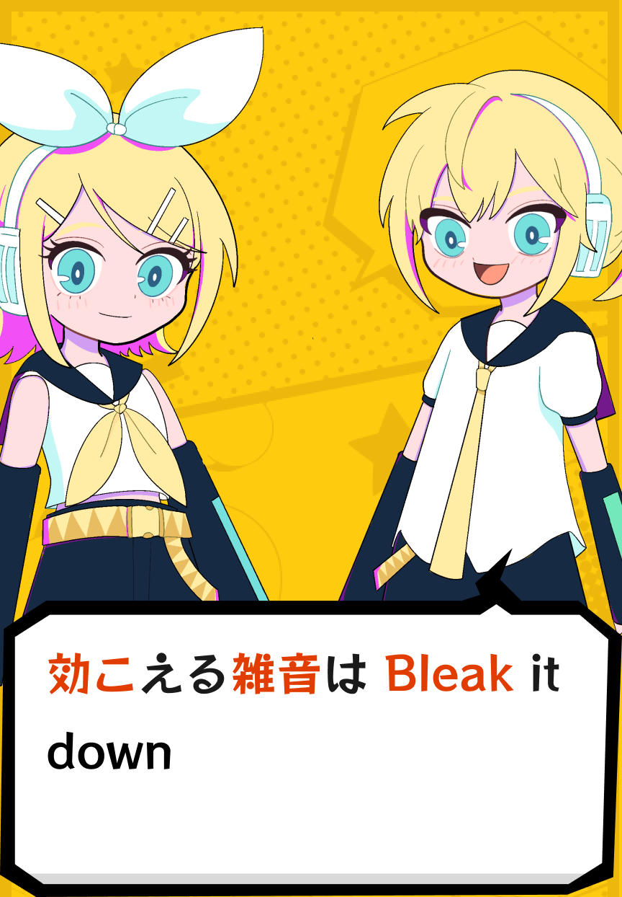
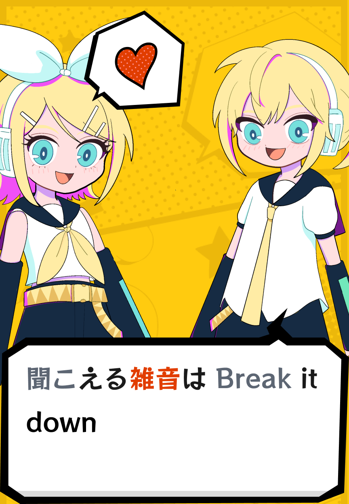
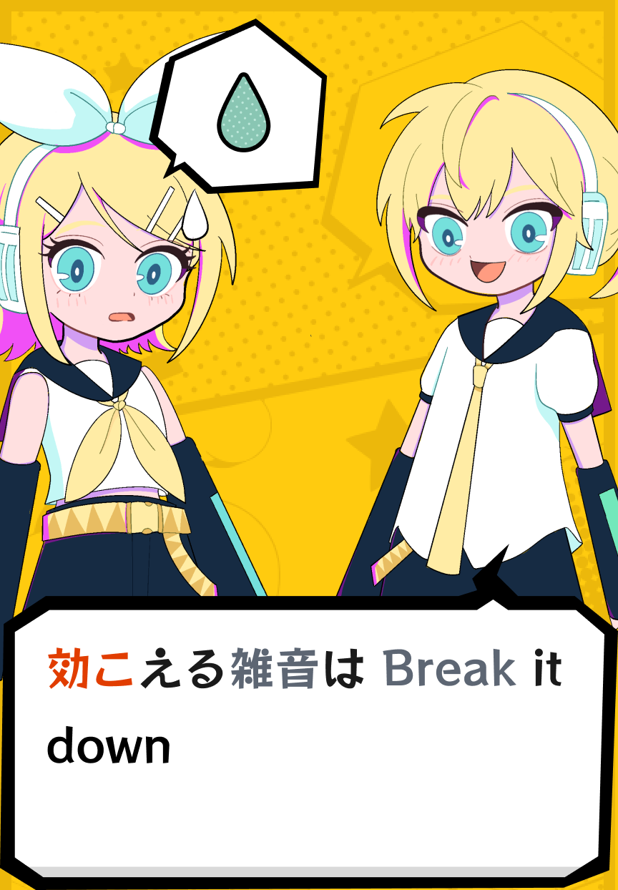
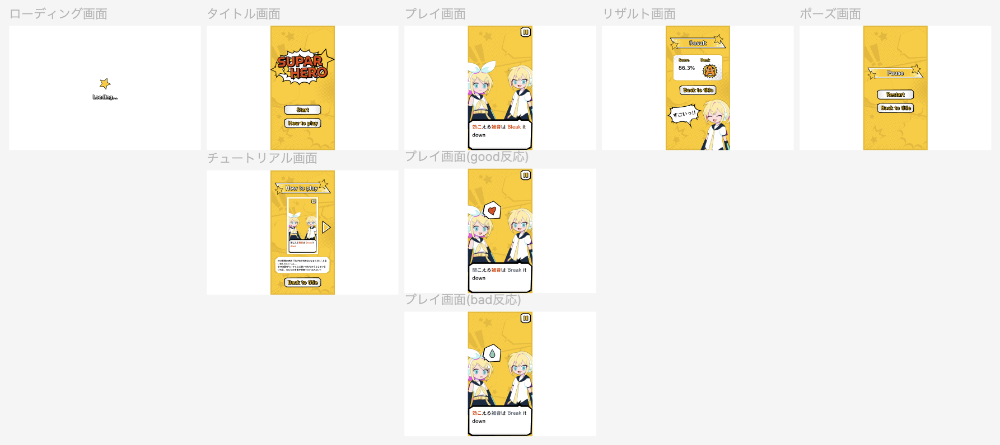
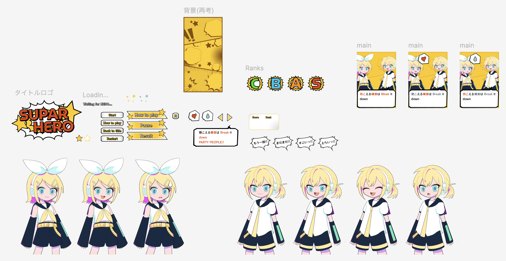

<div align="center">
  
</div>

<h1 align="center">⭐️ suparhero ⭐️</h1>

<div align="center">
  
  
</div>

<br>

<div align="center" style="display: flex; justify-content: center; gap: 16px;">
  
  
  
</div>

## 🎉 Overview

「**SUPARHERO**」は、[TextAlive App API](https://developer.textalive.jp/)を利用したリリックゲームアプリケーションです。

「**[初音ミク「マジカルミライ 2024」プログラミング・コンテスト](https://magicalmirai.com/2024/procon)**」への応募作品であり、楽曲にはめろくる様の「[SUPERHERO](https://youtu.be/EWGe3KRc144?si=NThdqauxb9UbFPFJ)」を使用しています。

以下のリンクから、ぜひ本アプリケーションを試遊してみてください!!

- https://suparhero.vercel.app

## 🤔 How to play?

本アプリケーションは、「SUPERHERO」の楽曲に合わせて、赤い文字で表示されている歌詞の中から、間違えている歌詞を見つけて修正していくゲームです。

回答が正しいかどうかは歌詞のセクションごとに、以下のパターンで評価されます。

- 間違えている歌詞を全てタップできた場合: `正解`
- 間違えている歌詞が1つでもタップされなかった場合: `不正解`
- 正しい歌詞を1つでもタップしてしまった場合: `不正解`

<div align="center" style="display: flex; justify-content: center; gap: 16px;">
  
  
  
</div>

<br>

最終的なスコアは、全セクションのうち正解したセクションがいくつあったかという正答率で表され、正答率によってランクが決定します。

- 正答率が50%未満: `Cランク`
- 正答率が50%以上-75%未満: `Bランク`
- 正答率が75%以上-90%未満: `Aランク`
- 正答率が90%以上: `Sランク`

<div align="center">
  
</div>

<br>

> [!TIP]
> 「SUPARHERO」の遊び方は本アプリケーションの「How to play」からも確認することができます!!

## 📚 Concept

「SUPERHERO」における"**HERO**"は、レンくんが憧れた「[HERO](https://youtu.be/o4AxMk3SGUY?si=xZ5qTrWbCSxOxb3L)」に登場するような頼もしく心強い印象のヒーローとは異なり、自身の心の弱さや恐怖に立ち向かい、成長していく過程の中で見つかる"**HERO**"です。そのような楽曲の印象をそのまま感じれるようなWebアプリケーションにしようと考えました。

"**HERO**"になりたい意気込みが先行する心配性な部分を「リリックのタイプミス」で表現し、ユーザはレンくんが"**HERO**"なるためのサポートをするような立ち位置でアプリケーションをデザインしています。

レンくんがカッコいい”**SUPERHERO**”になれるよう、本アプリケーションを通じてお手伝いしていだだけると幸いです!!

> [!NOTE]
> 楽曲の解釈はあくまで個人の見解です。

## 📱 System requirements

推奨環境などは特にありませんが、なるべく最新のブラウザで動作させることをおすすめします。

PCだけでなくiOSやAndroidなどのモバイル端末からも、本アプリケーションを遊んでいただくことができます。

## 🚀 Build & Deploy

以下のコマンドで、モジュールのインストールとビルドを行います。

```
$ npm install
$ npm run build
```

プロジェクトルートに生成される`out`ディレクトリを、静的ホスティングサービスにアップロードすることで、本Webアプリケーションをホストすることができます。

> [!NOTE]
> 以下のコマンドを実行することで、ローカル環境で直接Webアプリケーションを実行することもできます。
>
> ```
> $ npm run start
> ```

## 😤 Appeal Point

- 誤回答のパターンを数多く用意しており、ゲームが始まる度にレンくんが間違える単語や語彙がランダムに変わります。

- 「SUPERHERO」特有の日本語と英語が混じったリリックを、独自のパーサによってユーザが視認しやすくなるように改善しています。

- **Tailwind CSS**と**twMerge**によって、CSS管理の煩雑さを改善しつつ、場面によって容易にスタイルを変更できる柔軟さを持ち合わせたコンポーネント設計を行なっています。

- リリックの情報や画面遷移などを、propsを介さずグローバルに使えるようにするため、**Tanstack Query**と**useContext**を使用した状態管理を行なっています。

- **Framer Motion**でゲーム全般のアニメーションを制御しています。コンポーネント側にアニメーションの実装を移すことで、データ処理やレイアウトなどの関心事をなるべく分離しています。

## 🎨 Design

本アプリケーションのデザインやコンポーネントはFigmaで作成されています。

<div align="center">
  
</div>

<br>

<div align="center">
  
</div>

- 「SUPERHERO」の公式MVと雰囲気を統一するために、アメコミ調のUIを採用しています。

- フォントにはGoogle Fontsの`Rocknroll One`を使用しています。

## 🙇‍♂️ Special thanks

本アプリケーションは、以下の方々のご協力の元作成されています。本当にありがとうございました!!

- [**Kanon様**](https://x.com/kanonnot_)

  - とても可愛いリンちゃんとレンくんのイラストを書き下ろしていただきました!!

- [**OKUMONO様**](https://sozaino.site)

  - アメコミ調の背景や吹き出しなどの素材をお借りさせていただきました!!

また、このようなプログラミングコンテストの機会を下さったクリプトン・フューチャー・メディア株式会社様、および「SUPERHERO」の作曲者であるめろくる様にも、心より感謝いたします。
